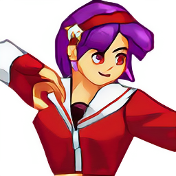

# SpriteFix

A script to help fix 8-bit sprites so that they are more upscale-friendly.

Normally when upscaling these sprites, the transparency bit will be taken into consideration by the upscaling model. This causes some fringe artifacts around the sprite.
<table bgcolor="gray"><tr><th>8-bit PNG</th><th>Upscale Result</th></tr>
<tr><td></td>
<td></td></tr></table>

This script will convert the sprite into 32-bit sprites so that transparency is handled by the alpha-channel, and pads around the sprite with pixels based on the sprite itself. 
<table bgcolor="gray"><tr><th>32-bit PNG</th><th>Upscale Result</th></tr>
<tr><td></td>
<td></td></tr></table>

### Dependencies

- Python 3 (Recommend to use [Anaconda](https://www.anaconda.com/download/#linux))
- [PyTorch >= 0.4.0](https://pytorch.org/)
- NVIDIA GPU + [CUDA](https://developer.nvidia.com/cuda-downloads)
- Python packages: `pip install numpy opencv-python`

### How to use
- Put in the sprites into the `input` folder. OpenCV is only able to read `png` and `jpg` files, so if you have `gif` files, convert them to `png` first.
- Run `python fixsprite.py`
- Output appears in `output`

## To Do list:
- Check if files are in 8-bit PNG with transparency first, otherwise skip.
- Add parameter handling so that user can define input and output folders themselves.

## Additional Help 
- Take note that not *all* sprites need to be fixed, and soome models may have better output without the padded pixels. Use only if fringe artifacts appear on the upscaled sprite.
If you have any questions, we have a [discord server](https://discord.gg/cpAUpDK) where you can ask them and a [Wiki](https://upscale.wiki) with more information.

---

